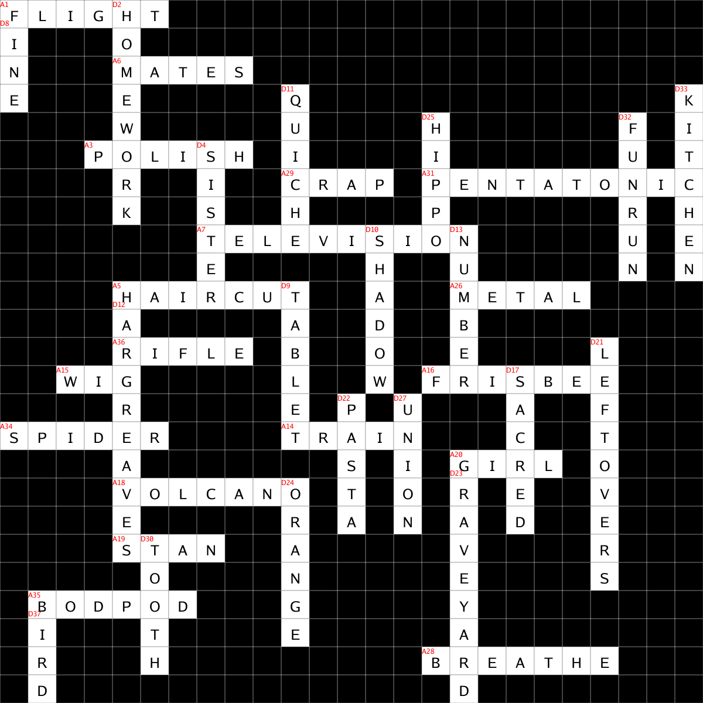

# Go Crossword

Package to generate a valid crossword puzzle from a list of words/clues.

Loosely based on: https://stackoverflow.com/a/22256214

The package does not guarantee all words can be placed in the grid but in general will 
usually get there if it's possible to do so (given enough attempts). 


Interactive: [DEMO](https://warmans.github.io/go-crossword/demo/)

Example: 

```bash
  $ go run cmd/generate/main.go example/words.json  
```

or to see completed:

```bash
  $ SOLVE_ALL=true go run cmd/generate/main.go example/words.json  
```

This will generate the following crossword from the given words file: `example/words.json`



### Note on interactive crosswords

If the crossword is being solved interactively you would need to store the
generated `Crossword` (e.g. json encode it to a file). This can easily 
be decoded and rendered without altering the layout.